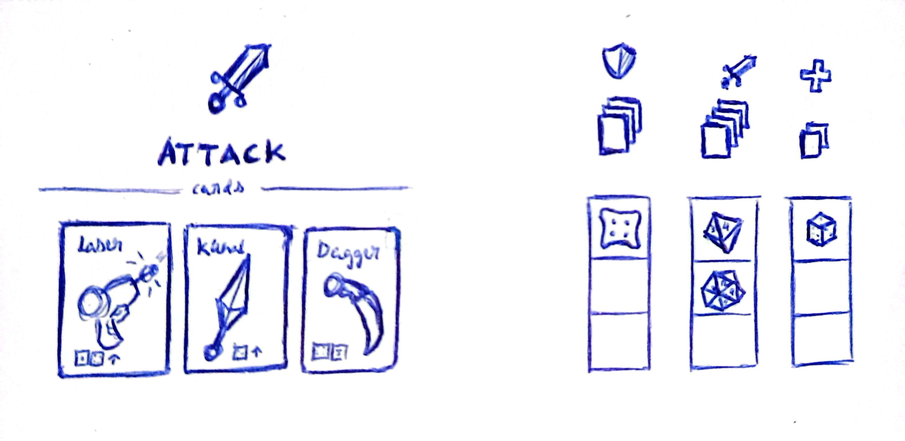

# Project: Let's Go ~~Gambling~~ Rolling

# Genre

Roguelike deckbuilder with turn and diceroll-based combat system 

### References: 
[Dicey Dungeon](https://store.steampowered.com/app/861540/Dicey_Dungeons/), [Darkest Dungeon](https://store.steampowered.com/app/262060/Darkest_Dungeon/), [Slice & Dice](https://store.steampowered.com/app/1775490/Slice__Dice/)

# Synopsis: 
You are a time traveler switching between the future and the past. Your goal is to defeat the interdimensional entity that is causing a breach in space-time, twisting the world bringing together dangers from ancient times and unwitnessed futuristic hazards.

Equipped with what you gather from killing these enemies in turn-based, card and dice roll battles; and find in past or future locations, such as markets or online crypto-auctions, you must continue the path towards this glitched interdimensional entity and restore your world.

# Controls
The game controls are mostly UI-based and only need your mouse and your ability to press left click.

# Style

Smooth vector art with light saturated colors, similar to Dicey Dungeons. Clear telegraphy of any icons, buttons, actions or menu contexts.

**The game is structured as follows**
The player advances from event to event in the map view of the world. The map view of the world is a graph view of the different event locations of the game (similar to [Pegglin](https://store.steampowered.com/app/1296610/Peglin/)'s), how to reach them and their connections. Besides, a player icon is seen on the current event location we are at. While in this view, the player can check out their inventory, and select the next event location (provided there is a graph adjacency from their current location).
An event location may be: a fight, shop, or bonus reward event.

When in a fight, the main card-and-dice-based mechanics of the game take over. The fight may conclude when you are killed by an enemy or when you succesfully kill all present in a fight, granting you with a card or dice reward and taking you back to the map view.

Both shops and reward events are addtional ways to fights to obtain a repertoir of card and dice to use in battles.

# Dynamics

Various dynacmics are present in the game in two different scopes: through the run and through an individual fight.

When traversing the map, the player may be interested in taking a bunch of fights or carefully planning to maximize passing through the most shops possible.
Equally, should the player be interested in a particular set of cards, they may beeline for every past or future event location they catch a glimpse of in the map view. Allowing them to craft a deck with a very defined "temporal aesthetic" and synergies.

When in a particular fight, the mechanics available enhance and leave clear various game-styles. Ones might bet all their dice to risky high attack cards. Whereas others might spread the love along all the card types; of defence, attack, heal. Or even be a personal fan of using the "reorganize dice" action and dynamically assign dice to different card type slots to adapt their strategies to the enemies dynamically.
Moreover, long term thinking is also present all whilst in a fight, given that the emotion stack is one more element to bear in mind. Allowing you to plan a sequence of card turns ahead to ~~gamble~~ roll your odds of getting the best of emotion combinations.

# Gameplay

A basic gameplay of the game would start with a view of the world map, where the player must select an available node of the map graph path apart from the period of time (past or future) he is going to travel to. The path is not linear, so the player can make a personalized run in his way to beat the boss.

The player can select different types of zone, like a mysterious chest, the store or a fight. After selecting a fight zone we will start a fight, where the enemies depend on the space and the time the player has selected, for example, if the player is travelling to the past a posible enemy could be a group of wizards while if the player travels to the future the enemy could be a cyborg. 

The starting fighter is chosen randomly and in each turn in case the enemy is more than one, only one will attack in that turn, after the attack of one enemy the next turn is for the player. In the player's turn, the UI will display the action menu, where the player can see the stack of emotions, the button of dice organizing, the rows of the dices of the attack, defeend, and heal actions with the button for choosing a card of the corresponding action type in each row, and the button of done to confirm the player's choice for that turn.
When the player presses the button to select a card of one type (attack, for example), four cards of that action type from the whole collection of cards the player has are selected and showed to the player in a popped menu, the player chooses one of them and closes the turn by pressing the Done button. After playing that card, it is replaced for the next turn with other card of the action category, but the player has the option to cancel the usage of the card before pressing the Done button if he finally decides to do another thing. The strategy of the gameplay where the fun part of the combat appears is when the player faces enemies with specific weaknesses and strengths and the health points and the emotions of both the player and the enemies require another way of acting.

The rest of the battle will follow this dynamic of switching between the turns of the player and the turns of an enemy until all the enemies or the player are dead. At the end of the battle the player obtains experience points, money, new cards to add to the collection, and new available locations in the map to visit.

## Mechanics
### Cards 
The cards are the most important and principal mechanic in this game. They represent the actions the player can do during the fight, this being divided in three subclasses, each representing the cards main purpose: attack cards, they deal damage to the enemy; defense cards, they help the player receive less damage; Heal cards, they restores the players health; This been said it is possible to find a card that is a fusion of two types, like: attack/defense, attack/heal or defense/heal.
Besides their main action, the card may have side effect and an emotion. All of this actions outcomes are decided by the dices roll, the stats bonus, the dice bonus and the emotion bonus, all of this bonuses will be talked about later on.

### Emotions
As we have said before, a way of improving your chances at landing your cards is your emotion bonus. Most cards have emotions integrated in them and they are not just for show. Each time the dices are rolled when you play a card with an emotion, if your roll is on the higher epsilon you will receive that cards beneficial emotion and it will give you a temporal buff in your attack, defense or heal power or it will upgrade your luck, making you hit higher rolls easier, giving you more emotions, which results in more luck, getting you on a roll, hitting more and more...but beware one very bad roll and the card will give you a negative emotion, this will debuff your strength, heal or defense power or make you hit lower rolls easier, as in the beneficial emotion, negative ones can also stack but in a slower pace giving you time to rise from the slump before you get too depressed 

### Character stats
Like in many games, stats are a big part of the players kit, in this game its no different. In time dice, the player counts with 3 stats: strength, constitution and resilience, each of them connected to the different movements the player can make: attack, defense and heal respectively. This stats are useful because they act as a bonus to o the dice roll punctuation of their respective classes,that way you can attain greater rolls during a fight. Each time you win a fight you gain experience to increase your level and increasing your level gives you points, you can spend the points to improve your stats. That way instead of leveling up all stats automatically and evenly, we give the players the chance to choose depending on their playstyle and strategy.

### Dice organizing
As explained before on the gameplay analysis, during your turn you may change your dices position depending on the state of the battle and your strategy. You start each battle with a set number of different kinds of dices which vary from the d4 dice to the d20 dice. By rearranging your dices you can place more or less dices in each action type: attack, defense, heal. Giving more dices to your attack will give you better probability on your rolls on attack cards, giving you not only more dices but also an additional dices bonus. But that's not the only bonus a dice can give, lets imagine, if you are fighting a cyborg that needs a 19 to be hit, you may think that using d20 dices is the best answer, but its not the best one its the safest one, and this game doesn't reward being safe. Using lower dices like 3d8 will not only allow you to hit but it will give you a bonus for using a lower dice and an even bigger bonus if you use a 3 d6. That way the game doesn't only reward the smartest and most strategic players but the ones with an inner gambler.

 

## Map representing

The game has a graph like map, inspired by games like dice dungeon, in which the player can choose an adjacent cell to the one he is in. Each cell has different purpose being either a fight, the store or something else. That said our map also gives the player the ability to choose either the future or  the past path, each one of these have different enemies to fight and weapons to get. This way, we let the player choose what path to pick in an even deeper level.

## Synergies

Due to the vast variety of cards, we have decided to give some cards synergies between each other, creating more combinations that will allow players to let their creativity and strategy blossom, like using a fire weapon to burn an enemy, then making it explode with electricity.

## Inspiration

Our game is inspired by different turn based games such as darkest dungeon and games based in dice games like, dicey dungeons, slice and dice and the game dungeons and dragons.

## ScreenShots

