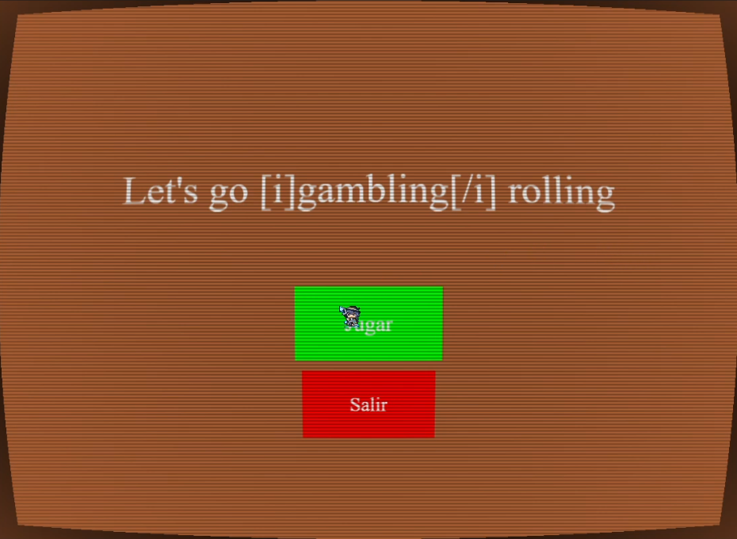
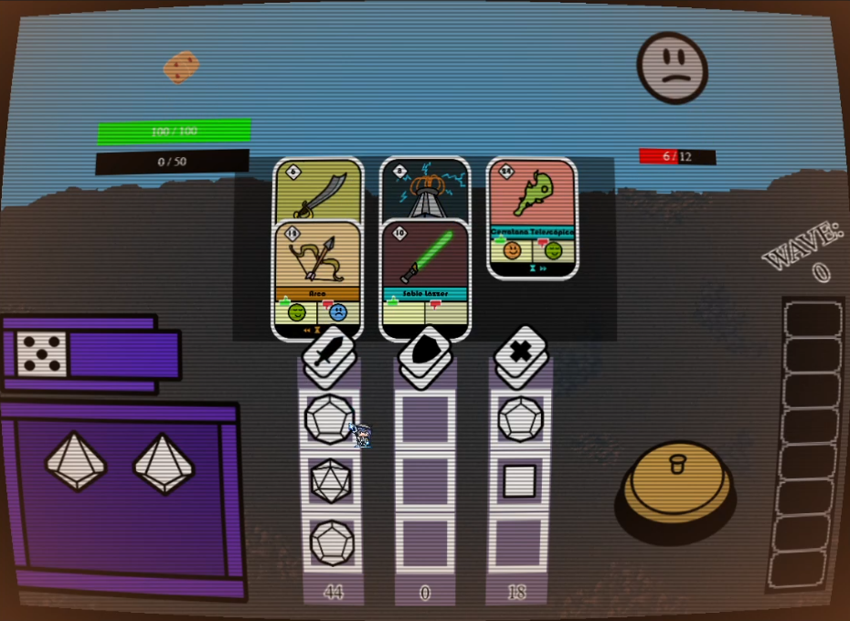
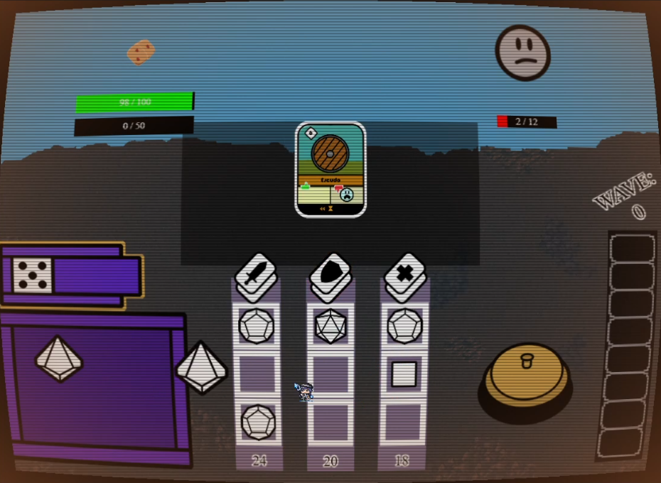
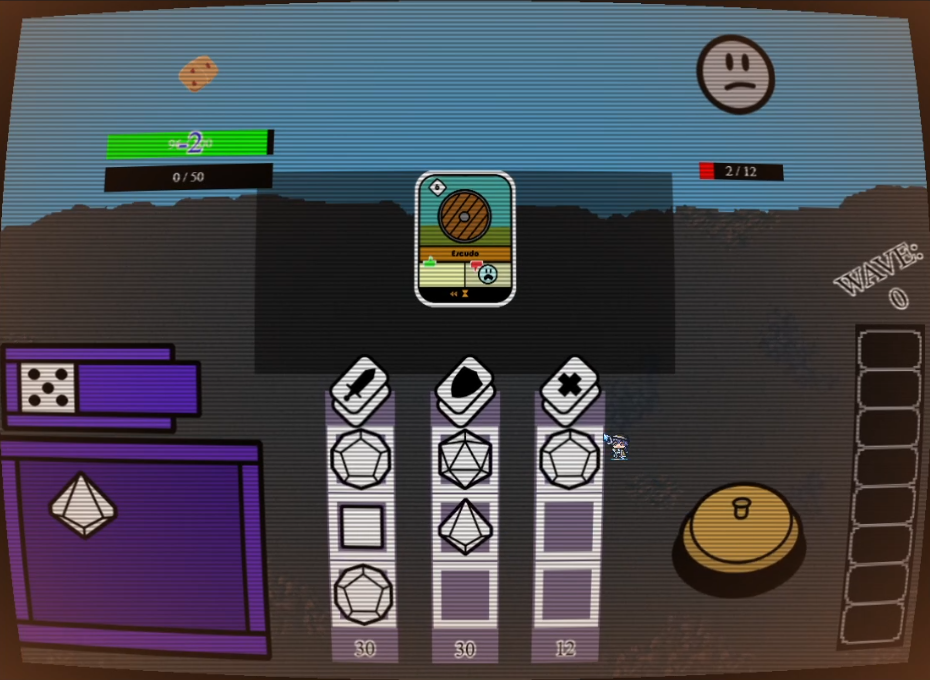
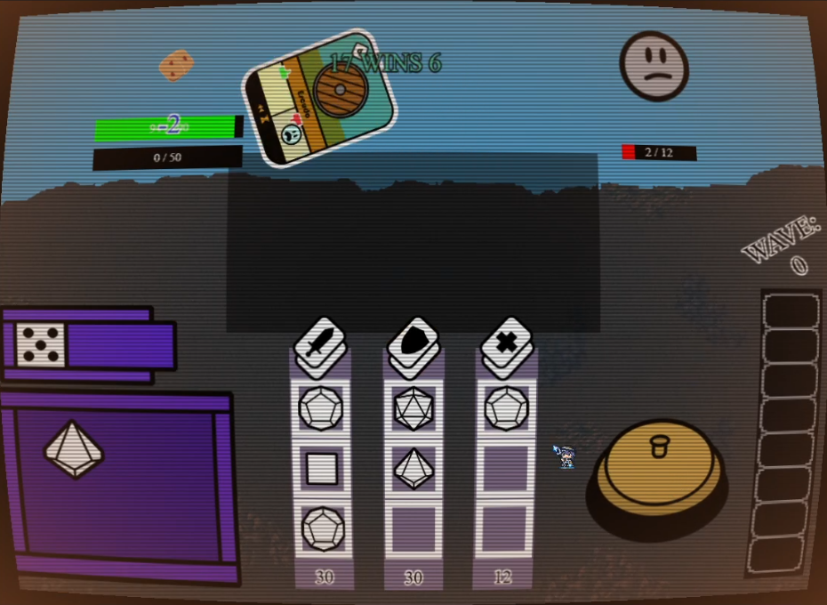
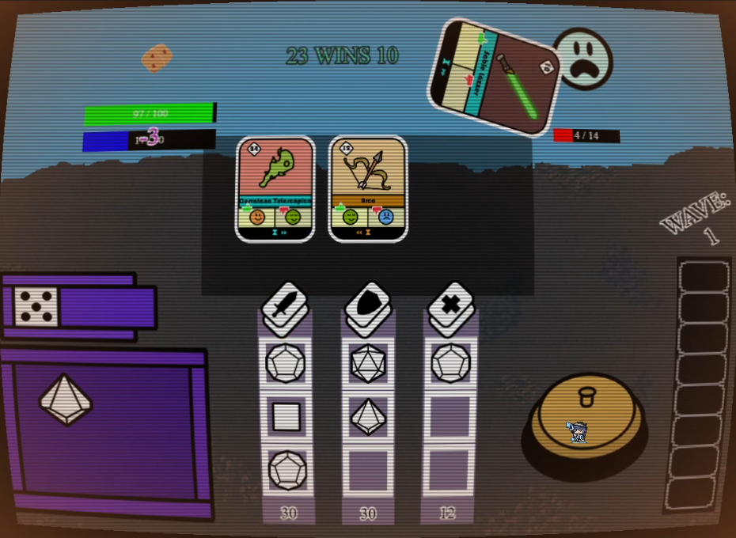
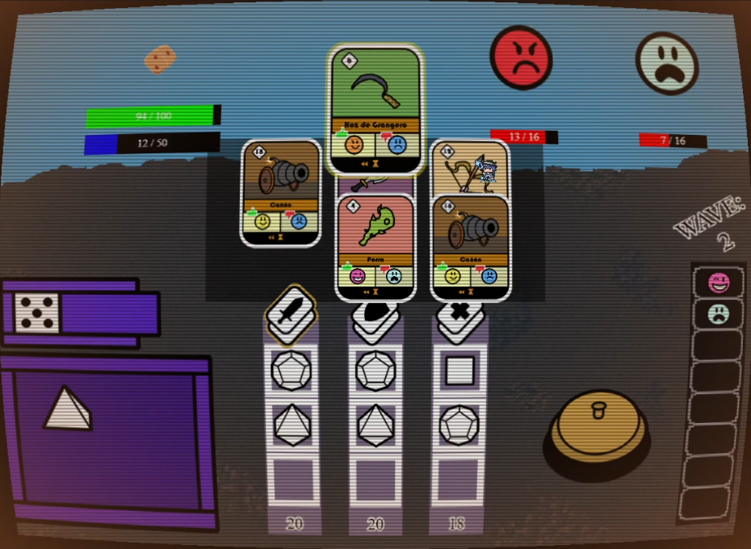
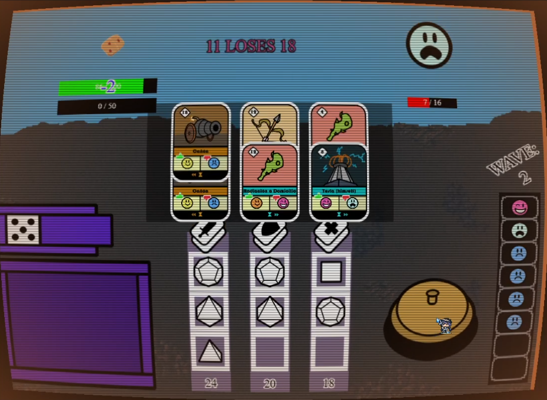
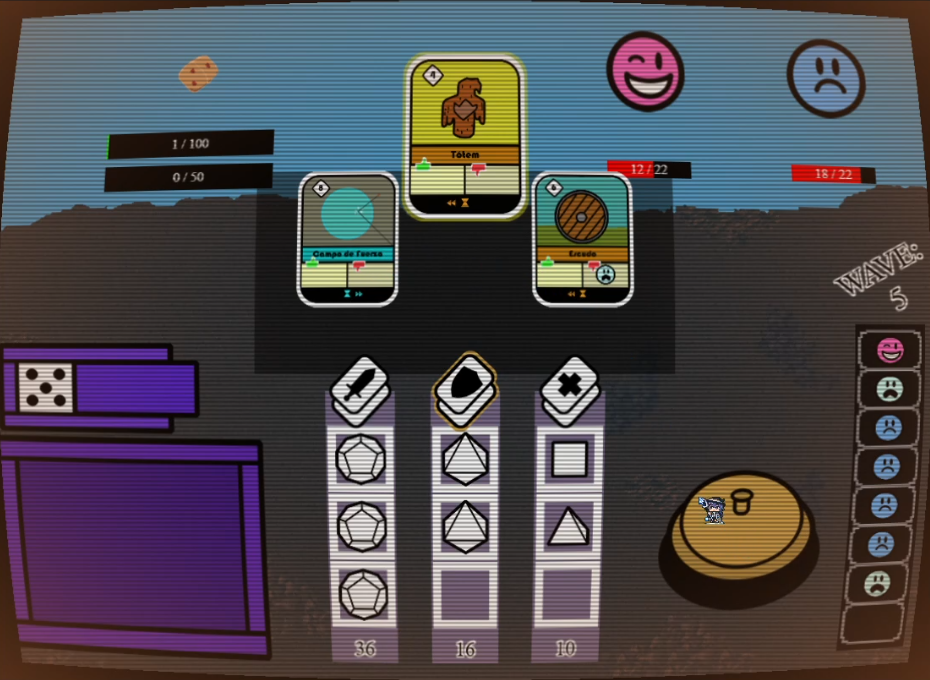

# Project

This game is a second year university project for  [Grado en Desarrollo de Videojuegos](https://www.ucm.es/data/cont/docs/titulaciones/1913.pdf) for the subject "Game Development in Interpreted Languages".

## Social Media

- [Instagram](https://www.instagram.com/guardian_enigma/)

## About Game

### Screenshots

### Presentation

[here](https://www.canva.com/design/DAGSb2_aZpQ/ZFZwUPKJRmssQXCX2dXBxQ/edit)

### Link

[here](https://ucm-pvli-grupo-3.github.io/Project/)

### Architecture

